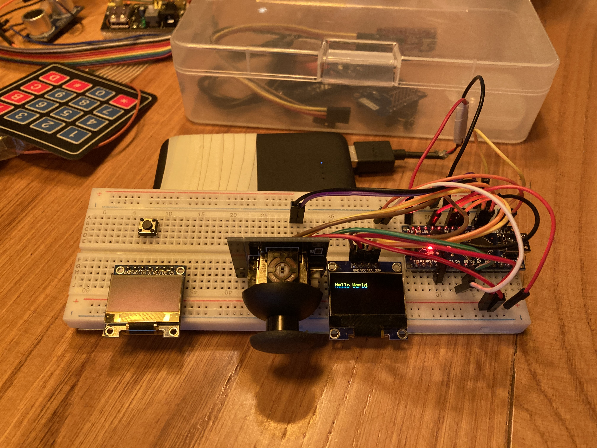

# Gameduino

This is a project that I have done to help other peoples who want to make a similar project.


## Roadmap

- Component design

- Code

- Tinkering all the components

## Libraries

- Graphic library : https://github.com/adafruit/Adafruit-GFX-Library

- Serial Peripheral Interface : https://github.com/arduino/ArduinoCore-avr/blob/master/libraries/SPI/src/SPI.h

- Inter-Integrated Circuit : https://github.com/rambo/I2C

- Display Library : https://www.arduino.cc/reference/en/libraries/adafruit-ssd1306/

## Helpful Resources

- Oled Display Tutorial : https://randomnerdtutorials.com/guide-for-oled-display-with-arduino/


## Screenshots



## Usage/Examples

- SPI Display setup

``` wiring
// Declaration for SSD1306 display connected using software SPI (default case):
#define OLED_MOSI   4 //D1
#define OLED_CLK   3  //D0
#define OLED_DC    6  
#define OLED_CS    7
#define OLED_RESET 5

Adafruit_SSD1306 display(SCREEN_WIDTH, SCREEN_HEIGHT,
  OLED_MOSI, OLED_CLK, OLED_DC, OLED_RESET, OLED_CS);
```

- I2C Display setup
``` wiring
// Declaration for SSD1306 display connected using software I2C (default case):
#define SCREEN_WIDTH 128	
#define SCREEN_HEIGHT 64	
#define OLED_RESET 4		 - if your screen has no reset pin, you have to change that value to -1

Adafruit_SSD1306 display(SCREEN_WIDTH, SCREEN_HEIGHT, &Wire, OLED_RESET);

#define SCREEN_ADDRESS 0x3C

void setup() {

  display.begin(SSD1306_SWITCHCAPVCC, SCREEN_ADDRESS);
  
          }
```

- Screening Hello World on I2C display
``` wiring
// Declaration for SSD1306 display connected using software I2C (default case):
#define SCREEN_WIDTH 128	
#define SCREEN_HEIGHT 64	
#define OLED_RESET 4		 - if your screen has no reset pin, you have to change that value to -1

Adafruit_SSD1306 display(SCREEN_WIDTH, SCREEN_HEIGHT, &Wire, OLED_RESET);

#define SCREEN_ADDRESS 0x3C

void setup() {

  display.begin(SSD1306_SWITCHCAPVCC, SCREEN_ADDRESS);
  display.println("Hello World");
  display.display();
 
          }
```

- SD Card Write - Read and Random Selection code Example
``` wiring
#include <SPI.h>
#include <Wire.h>
#include <Adafruit_GFX.h>
#include <Adafruit_SSD1306.h>
// Declaration for SSD1306 display connected using software I2C (default case):
#define SCREEN_WIDTH 128  
#define SCREEN_HEIGHT 64  
#define OLED_RESET -1     //- if your screen has no reset pin, you have to change that value to -1

int xPin = A0; 
int yPin = A1; 
int butonPin = 2; 

int xPozisyon;
int yPozisyon;
int butonDurum;

Adafruit_SSD1306 display(SCREEN_WIDTH, SCREEN_HEIGHT, &Wire, OLED_RESET);

#define SCREEN_ADDRESS 0x3C
const char *Listem[] = {"Falan filan nedir?", "Falan filan nedir?", "Falan filan nedir?", "Falan filan nedir?"};
const char *Listem2[] = {"Falan filan nedir?", "Falan filan nedir?", "Falan filan nedir?", "Falan filan nedir?"};
const char *Listem3[] = {"Falan filan nedir?", "Falan filan nedir?", "Falan filan nedir?", "Falan filan nedir?"};
const char *Listem4[] = {"Falan filan nedir?", "Falan filan nedir?", "Falan filan nedir?", "Falan filan nedir?"};
const char *Listem5[] = {"Falan filan nedir?", "Falan filan nedir?", "Falan filan nedir?", "Falan filan nedir?"};
const char *Listem6[] = {"Falan filan nedir?", "Falan filan nedir?", "Falan filan nedir?", "Falan filan nedir?"};

long randNumber;

void setup() {
  
  Serial.begin(9600);
  pinMode(xPin, INPUT);
  pinMode(yPin, INPUT);
  pinMode(butonPin, INPUT_PULLUP);

  display.begin(SSD1306_SWITCHCAPVCC, SCREEN_ADDRESS);
  display.clearDisplay();
  display.display();
  display.setTextSize(1);
  display.setTextColor(WHITE);
  display.setCursor(0, 10);
  display.println("Hello World");
  display.display();
 
          }
 void loop(){
  xPozisyon = analogRead(xPin);
  yPozisyon = analogRead(yPin);
  butonDurum = digitalRead(butonPin);
  
  xPozisyon = map(xPozisyon, 0, 1023, 0, 128);
  yPozisyon = map(yPozisyon, 0, 1023, 0, 32);
  Serial.print("X Pozisyonu: ");
  Serial.print(xPozisyon);
  Serial.print(" | Y Pozisyonu: ");
  Serial.print(yPozisyon);
  Serial.print(" | Buton Durum: ");
  Serial.println(butonDurum);
  delay(100);

  randNumber = random(0, 4);
  display.println(Listem[randNumber]);
  display.clearDisplay();
  delay(10000);
  display.display();
  display.println(Listem7[randNumber]);
  delay(10000);
   display.clearDisplay();
  delay(10000);
  display.display();
  display.println(Listem2[randNumber]);
  delay(10000);
   display.clearDisplay();
  delay(10000);
  display.display();
  display.println(Listem3[randNumber]);
  delay(10000);
   display.clearDisplay();
  delay(10000);
  display.display();
  display.println(Listem4[randNumber]);
  delay(10000);
   display.clearDisplay();
  delay(10000);
  display.display();
  display.println(Listem5[randNumber]);
  delay(10000);
   display.clearDisplay();
  delay(10000);
  display.display();
  display.println(Listem6[randNumber]);
  delay(10000);
}
```


 
